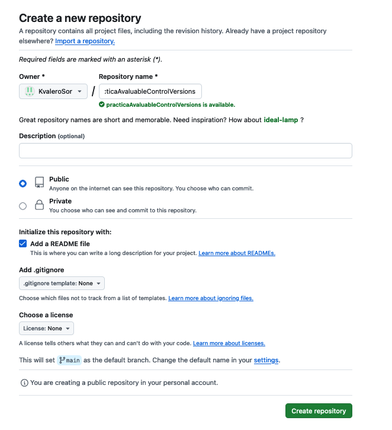

# Pràctica Avaluable Sistemes de Controls de Versions 2nd CFGS Semipresencial DAW - Kike Valero

### Introducció teòrica de què és Git.

    Git és un "Sistema de control de versions distribuit" açò què significa, açò significa que si clonem
    un repositori remot en la nostra area local què ens va a permetre treballar bé siga amb connexió com
    sense connexió i de forma totalment remota, sense afectar el nostre codi al codi font o dels
    nostres companys.
    Una vegada hem fet tot el què deviem fer amb el codi confirmem de forma local els canvis realitzats i
    a continuació sincronitzem la copia del nostre repositori local amb el servidor remot. Fer-ho d´aquesta
    forma va a permetrems vore diferencies amb codi de companys o amb el codi font i poder avaluar que canvis
    interessen implementar i quins no, alguns del canvis podrien ser errates que gràcies al sistema que
    implementa Git és pot avaluar abans de canviar el codi font.

#### Característiques de Git.

        - Branques.
        - Confirmacions d´arxius.
        - Desenvolupament simultani.
        - Integració incorporada.

### Metodologia Git Flow.

    La metodologia Git Flow com nomenàvem abans en les característiques de Git, es una estructura de branques que
    facilita la gestió, organització i desenvolupament dels nostres projectes. Per dir-ho d´alguna manera,
    "Es una forma de tindre ordenat el desorde".

    No deixa de ser un patró estandar, la qual cosa fa que siga més fàcil d´interpretar per tots, siga la companyia
    que siga i el projecte que siga.

    Esta es basa en una estructura de branques les quals son:

        - Main -> Rama en la qual estarà desplegat el codi en producció.
        - Develop -> Rama en la qual estarà integrat el codi més recent què és preparà per passar-lo a producció.
        - Feature -> Rama per a desenvolupar noves funcionalitats.
        - Release -> Rama on és prepara i s´estabilitza una versió abans de passar-la.
        - Hotfix -> Rama què on és fan solucions ràpides per a problemes que sorgixen en producció.
        - Support -> Rama per donar suport a versions més antigues o especifiques.

### Perquè la utilitzem en el nostre desenvolupament.

    L´utilitzem en el nostre desenvolupament perquè és una forma molt neta de tindre el codi organitzat, i de
    tindre una molt bona trazabilitat de la evolució del nostre codi, ja que en tot moment és pot fer seguiment del
    mateix, dels **camins que ha tingut** i de qui és l´autor que ho ha desenvolupat.

    Per a projects xicotets pot ser no siga extremadament avantatjós, però quan parlem de projectes grans, on es veuen
    involucrades moltes persones, és la millor opció, no obstan, siga avantatjós o no, va a deixar-nos una estructura de
    projecte molt fàcil d´interpretar i de seguir per si a futur d´altres persones què no han estat en un principi en la
    creació de dit projecte necessiten treballar sobre ell.

## Explicació detallada del procés realitzat.

### Tasques Usuari 1: 

        · Creació del repositori: practicaAvaluableControlVersions.

            És crea el repositori remot en GitHub on volem iniciar el nostre projecte, s´afegeix el nom i 
            l´arxiu README.md.

        · Clonant el repositori remot en l´area local.

            És clona el repositori remot en l´area local on anem a treballar amb ell. 
            
            - Comando utilitzat: 

                - git clone <url del repositori remot>

        · Creant branca develop i push de la branca develop al repositori remot.

            És crea la branca develop del projecte.
            És fa push al repositori remot per afegir els canvis.

            - Comandos utilitzats: 

                - git checkout -b <nom de la branca (develop) en el nostre cas>
                - git push origin <nom de la branca (develop) en el nostre cas>

        · Afegint la codi inicial del projecte "boilerplate" a la branca develop.

            En aquest cas s´ha utilitzat una "boilerplate" per donar-nos 
            un codi font base del projecte.
            
            - Comandos utilitzats: 

                - git add <nom del directori on es troba la "boilerplate">
                - git commit (afegim un missatge amb la següent estructura:
                    
                    * Nom d´usuari - Títol del commit.

                    * Breu descripció del que s´ha fet a la modificació.)

  
        · Missatge de commit inicial a develop. (Explicació de l´estructura en el punt anterior).

        · Metodologia GitFlow. Creació de les branques "feature", "release" i "Hoffix" i push de les mateixes.

            És creen les branques "feature", "release" i "hotfix" al repo local i es fa un push
            per pujarles al repositori remot, de tal forma què estiguen disponibles per a la resta
            de companys.

            - Comandos utilitzats: 

                    * git checkout -b feature.
                    * git checkout -b release.
                    * git checkout -b hotfix.
                    * git push origin features.
                    * git push origin release.
                    * git push origin hotfix.

        · Resum de les branques creades i afegides al repositori remot.

            La branca support no s´ha afegit perquè el projecte es desenvolupa desde 0 i com es una branca
            que dona support a versions més antigues i especifiques no s´ha creat de moment.

            - Comandos utilitzats: 

                * git branch.

            

        · Creació del "hotfix/milloresV_1_0".

            L´usuari 1 crea un "hotfix/milloresV_1_0" per realitzar millor al codi que ha creat 
            l´usuari 2.
            
            L´usuari 1 es porta les branques que ha utilitzat l´usuari 2 per poder fer desprès la
            fusió dels canis.
            
            Una vegada disposa del codi que ha creat l´usuari 2 a la branca "hotfix/milloresV_1_0" 
            efectua els canvis que considera oportuns.

            Finalitzats el canvis fusiona la branca "hotfix/milloresV_1_0" amb les branques que havia 
            modificat l´usuari 2 | feature/contingutsHTML | feature/atributsHTML.            

                - Comandos utilitzats: 

                    * git checkout -b hotfix/milloresV_1_0.
                    * git checkout -b feature/contingutHTML origin/feature/contingutHTML.
                    * git checkout -b feature/atributsHTML origin/feature/atributsHTML.
                    * git checkout hotfix/milloresV_1_0. (Per situarse a la branca hotfix).
                    * git merge feature/contingutHTML.
                    * git merge feature/atributsHTML.
            
            Si en el procés de fusionar les diverses branques hi trobem algún conflicte, el resolguem de 
            forma manual al editor i actualitzem l´arxiu afegint-lo al stage i fent un commit del mateix.

        · Missatge del commit de les millores.

### Observacions.

        És podrá vore al repositori remot que hi ha dos colaboradors, son la mateixa persona, es a dir, jo. 
        
        Abans de començar el curs gastava un altre usuari de git per a iniciar-me en la tecnologia ja què la 
        conec de fa alguns anys però fins hores d´ara no sabia gastar-la "com es degut". 

        Tenia el git configurat amb eixe usuari i email, més avant ja entrats en el curs vaig decidir 
        crear-me´n un altre conter de git per tindren un un poc mes "professional" amb els coneiximents què anaba 
        a adquirir al curs. 
        He tornat a configurar l´usuari i el email i ho adjunte per evitar que hi hagen confusions.

### Tasques Usuari 2:

        · Clonant repositori en el directori del Usuari 2.

            És clona el repositori remot en l´area local on anem a treballar amb ell. 
            
            - Comando utilitzat: 

                - git clone <url del repositori remot>

        · Creant la branca develop en local i traguent el contingut de la branca origin/develop.

            És crea la branca develop en local traguent desde el repositori remot el contingut de la 
            branca develop.
            Per asegurar-se de què la branca develop és queda actualitzada fem un pull a la branca origin.

            - Comando utilitzats: 

                - git checkout -b develop origin/develop.
                - git pull origin develop.

        · Creació de les branques feature.

            És creen les branques "feature/contingutHTML" i "feature/atributsHTML" per tal de fer les
            modificacions pertinents en cada una de les branques.            

                - Comandos utilitzats: 

                    * git checkout -b feature/contingutsHTML.
                    * git checkout -b feature/atributsHTML.

        · Afegint l´arxiu contingutsHTML.

            La branca "feature/contingutsHTML" s´encarrega de crear a la barra de navegació de l´arxiu 
            "index.html" un accés a una nova pàgina anomenada "Modificacions continguts HTML".
            També es crea dit arxiu amb el seu contingut.

            És fa commit i push de la mateixa per pujar les modificacions a la branca feature/contingutHTML
            del repositori remot.

                - Comandos utilitzats:

                    * git add <nom del arxiu/directori on shan fet les modificacions>.
                    * git commit (afegim un missatge amb la següent estructura:
                    
                        * Nom d´usuari - Títol del commit.

                        * Breu descripció del que s´ha fet a la modificació.)                    
                    * git push origin feature/contingutsHTML.

        · Afegint l´arxiu contingutsHTML.

            La branca "feature/atributsHTML" s´encarrega de crear a la barra de navegació de l´arxiu 
            "index.html" un accés a una nova pàgina anomenada "Modificacions atributs HTML".
            També es crea dit arxiu amb el seu contingut.

            És fa commit i push de la mateixa per pujar les modificacions a la branca feature/atributsHTML
            del repositori remot.

                - Comandos utilitzats:

                    * git add <nom del arxiu/directori on shan fet les modificacions>.
                    * git commit (afegim un missatge amb la següent estructura:
                    
                        * Nom d´usuari - Títol del commit.

                        * Breu descripció del que s´ha fet a la modificació.)                    
                    * git push origin feature/atributsHTML.

